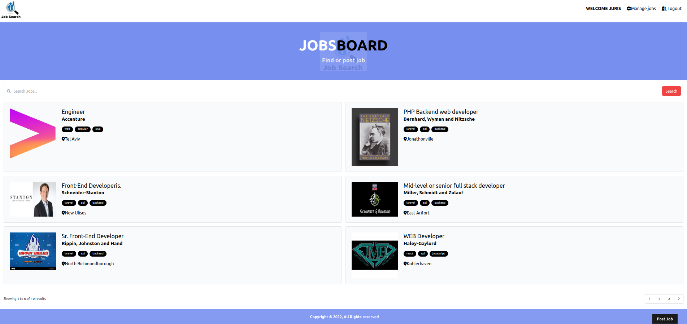

# PHP/Laravel/Alpine.js/MySql created website for job recruitment. 

## Fully functional CRUD application, with user authentication.

---



---


# How To Set up:


### ! Requirement: Mysql or any other database for information storing.

### 1. Clone or download to your chosen directory

### 2. Open with your chosen editor.

### 3. First you need  to rename .env.example file to .env.

### 4. Next fill the .env file in core folder with your MySql(or any other db, then change driver in .env from mysql to sqlite etc..)

### 5. Set in .env file ip address/databases name, which will be used/username/password if exists.

### 6. Migrate migrations to fill your database with all the necessary tables and columns:

```
php artisan migrate
```

### 7. Seed the database if you need fake text:

````
php artisan db:seed
````

###  8. Default images are located in public/images:
#### icon.png for tab icon
#### logo.png for logo images
#### no_image.svg for alternative image if no image exists


### 9. File Logo/photo Upload:
#### When uploading logo/photo files, they go to "storage/app/public" you need to
#### create a symlink with the following command to make them publicly accessible:

````
php artisan storage:link
````

### 10. Running Then App command:

````
php artisan serve
````

---
